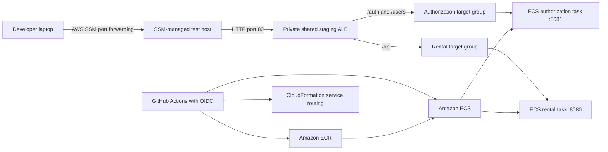

# Service Development and AWS Staging Deployment Guide

This guide is for a developer who needs to:

- change and deploy an existing service;
- add a new Spring Boot service;
- check code into GitHub safely;
- confirm that GitHub Actions deployed the service to AWS ECS Fargate; and
- test the private staging API from a macOS or Windows computer.

The examples use the RAS staging environment in AWS account `002356212742`, region `us-east-2`.

## 1. Understand the deployment architecture



The ALB is **internal**, not internet-facing. A browser, Bruno, or `curl` on a laptop cannot reach it directly. Use the SSM tunnel in [Section 8](#8-open-a-private-staging-tunnel).

### Repository ownership

| Repository | Owns |
| --- | --- |
| `deployment-templates` | Shared VPC/subnet references, security-group access, private ALB, HTTP listener, default `404`, and CloudFormation exports |
| Each service repository | Application code, tests, Dockerfile, ECR image, service target group, listener rule, ECS task definition, ECS service, runtime configuration, and rollout |

Do not add a service target group or listener rule to the shared ALB template. Those resources belong in the service repository so the service can be deployed and rolled back independently.

### Current staging values

| Item | Value |
| --- | --- |
| AWS account | `002356212742` |
| Region | `us-east-2` |
| ECS cluster | `ras-fargate-cluster` |
| Shared stack | `ras-staging-shared-alb` |
| Shared ALB DNS | `internal-ras-staging-shared-alb-148066285.us-east-2.elb.amazonaws.com` |
| SSM test instance | `i-0c4e0c38124ec182e` |
| Authorization routes | `/auth`, `/auth/*`, `/users`, `/users/*` |
| Rental routes | `/api`, `/api/*` |

Treat resource IDs and DNS names as discoverable configuration, not values to copy into application code. The commands below show how to retrieve the current values.

## 2. Install local tools

You need organization access to the three GitHub repositories and permission to use the staging AWS account.

Required tools:

- Git
- JDK 25
- Maven 3.9 or newer
- Docker Desktop
- AWS CLI v2
- AWS Session Manager plugin
- Bruno for API requests
- GitHub CLI, recommended for workflow and repository administration
- `jq` on macOS; PowerShell uses `ConvertFrom-Json` instead

### macOS

Install [Homebrew](https://brew.sh/) first if it is not already available, and then run:

```bash
brew install git openjdk@25 maven awscli session-manager-plugin gh jq
brew install --cask docker bruno
```

Add Java 25 to the shell path if Homebrew does not do so automatically:

```bash
echo 'export PATH="/opt/homebrew/opt/openjdk@25/bin:$PATH"' >> ~/.zshrc
source ~/.zshrc
```

On an Intel Mac, Homebrew may use `/usr/local` instead of `/opt/homebrew`. Use the path printed by `brew info openjdk@25`.

Start Docker Desktop once after installation. Verify the tools:

```bash
git --version
java --version
mvn --version
docker --version
aws --version
session-manager-plugin --version
gh --version
jq --version
```

### Windows 10 or 11

Open PowerShell. Install tools with Windows Package Manager:

```powershell
winget install --id Git.Git -e
winget install --id EclipseAdoptium.Temurin.25.JDK -e
winget install --id Apache.Maven -e
winget install --id Docker.DockerDesktop -e
winget install --id Amazon.AWSCLI -e
winget install --id Amazon.SessionManagerPlugin -e
winget install --id GitHub.cli -e
winget install --id Bruno.Bruno -e
```

Close and reopen PowerShell so its `PATH` includes the new programs. Start Docker Desktop once, then verify:

```powershell
git --version
java --version
mvn --version
docker --version
aws --version
session-manager-plugin --version
gh --version
```

If Maven is not available through `winget` in your environment, download the binary archive from the [Apache Maven installation page](https://maven.apache.org/install.html), extract it, set `MAVEN_HOME`, and add `%MAVEN_HOME%\bin` to the system `Path`.

## 3. Configure GitHub and AWS access

### GitHub authentication

Authenticate the GitHub CLI:

```bash
gh auth login
```

The same command works in PowerShell. Choose `GitHub.com`, `HTTPS`, and browser authentication. Confirm that the authenticated account can access the `RAS-Software-Devs` organization:

```bash
gh auth status
gh repo view RAS-Software-Devs/deployment-templates
```

### AWS SSO authentication

Configure a named profile once:

```bash
aws configure sso --profile PROFILE_NAME
```

Use the AWS SSO start URL, SSO region, account, and role provided by the team administrator. The current team example profile is named `RonikDesai`, but each developer may choose a different local profile name.

Log in before using AWS CLI or opening a tunnel:

```bash
aws sso login --profile PROFILE_NAME
aws sts get-caller-identity --profile PROFILE_NAME --region us-east-2
```

The same commands work in PowerShell. A successful identity response must show account `002356212742`. If AWS reports that the SSO token expired, run `aws sso login` again.

## 4. Change and deploy an existing service

Use this flow for normal application changes. Examples below use `rental-space-service`; replace the repository name for another service.

### 4.1 Clone or update the repository

macOS:

```bash
mkdir -p ~/RASComp2026
cd ~/RASComp2026
gh repo clone RAS-Software-Devs/rental-space-service
cd rental-space-service
git switch main
git pull --ff-only
```

Windows PowerShell:

```powershell
New-Item -ItemType Directory -Force "$HOME\RASComp2026" | Out-Null
Set-Location "$HOME\RASComp2026"
gh repo clone RAS-Software-Devs/rental-space-service
Set-Location rental-space-service
git switch main
git pull --ff-only
```

If the repository is already cloned, only run `git switch main` and `git pull --ff-only` from that repository.

### 4.2 Create a branch

Never develop directly on `main`.

```bash
git switch -c feature/short-description
```

Use `fix/short-description` for a bug fix. Keep each branch focused on one change.

### 4.3 Build and test locally

Run the same Maven verification command used by GitHub Actions:

```bash
mvn -B verify
```

Build the container for the local machine:

```bash
docker build -t rental-space-service:local .
```

A local application run may also require database and JWT environment variables. Follow the service README or `application.yml`; never commit secret values. The CI test suite must not depend on a developer's private `.env` file.

Before committing, review only the intended changes:

```bash
git status --short
git diff
git diff --check
```

On PowerShell, these Git and Maven commands are identical.

### 4.4 Commit and push

```bash
git add path/to/changed-file path/to/another-file
git status --short
git commit -m "Describe the service change"
git push -u origin feature/short-description
```

Prefer explicit `git add` paths. Do not accidentally commit `target/`, generated artifacts, local environment files, AWS output files, or credentials.

Create a pull request:

```bash
gh pr create --fill
```

A reviewer should confirm that tests pass, secrets are not exposed, API behavior is intentional, and any routing or runtime changes are documented. Merge the pull request through GitHub after approval.

### 4.5 Follow the deployment

A merge or push to `main` starts `.github/workflows/fargate-deploy.yml`. The service workflows perform this sequence:

1. Check out the exact Git commit.
2. Run the configured build checks. Rental explicitly runs `mvn -B verify`. Authorization currently compiles the package during its Docker build with tests skipped, so `mvn -B verify` must be run before merge until that workflow gains a test step.
3. Obtain temporary AWS credentials through GitHub OIDC.
4. Deploy the service-owned CloudFormation routing stack.
5. Build an `amd64` and `arm64` container image.
6. Push the image to ECR with the immutable Git SHA as its tag.
7. Register a new ECS task-definition revision.
8. Create or update the ECS service as supported by that workflow and wait for it to become stable. The current authorization workflow requires its ECS service to be bootstrapped already.
9. Roll back automatically if the ECS deployment circuit breaker detects a failed rollout.

View recent workflow runs:

```bash
gh run list --workflow fargate-deploy.yml --limit 10
gh run view RUN_ID --log-failed
```

These commands work in PowerShell. A green workflow is necessary, but complete verification also includes checking ECS and testing the private API.

## 5. Onboard a new service

Use an existing service repository as the working reference. `rental-space-service` is the clearest complete example because its workflow runs tests, creates routing, builds the image, creates or updates ECS, and waits for stability.

Choose these values before editing files:

| Value | Requirement | Example |
| --- | --- | --- |
| Repository and ECS service name | Unique, lowercase, descriptive | `payment-service` |
| Container port | Must match Spring, Docker, target group, and ECS | `8082` |
| ALB path prefix | Unique and owned by this service | `/payments` |
| Listener priority | Unique integer on the shared listener | `30` |
| Target-group name | Unique, at most 32 characters | `ras-stg-payment-tg` |
| ECR repository | Unique repository name | `payment-service-repo` |
| Task-definition family | Unique staging family | `payment-service-staging` |
| CloudWatch log group | Unique and provisioned before rollout | `/ecs/payment-service` |

Confirm the proposed path, port, priority, and name with the team. Duplicate listener priorities fail CloudFormation deployment; overlapping paths can send requests to the wrong service.

### 5.1 Create the GitHub repository

A team administrator can create an empty private repository:

```bash
gh repo create RAS-Software-Devs/payment-service --private --clone
cd payment-service
git switch -c feature/initial-service
```

If the repository already exists, clone it as shown in [Section 4.1](#41-clone-or-update-the-repository).

### 5.2 Add the application contract

A deployable Spring Boot service needs:

- a Maven wrapper or `pom.xml` that builds with Java 25;
- tests that run with `mvn -B verify`;
- a production `Dockerfile`;
- a known HTTP port;
- Spring Boot Actuator and a public `GET /actuator/health` endpoint;
- stateless authentication for protected endpoints;
- runtime configuration supplied by environment variables or Secrets Manager;
- no credentials or environment-specific secret values in Git; and
- application logs written to standard output/error for the `awslogs` driver.

The health endpoint must return HTTP `200` without a JWT. For Spring Security, explicitly permit `/actuator/health` and `/actuator/health/**`. Do not expose every Actuator endpoint publicly.

If the new service accepts JWTs issued by `user-authorization-service`, inject the same Secrets Manager value as `AUTH_JWT_SECRET` and configure the decoder for HS256. The ECS execution role needs permission to read that secret. The secret itself must never appear in GitHub Actions logs or source files.

### 5.3 Add service-owned routing

Create `infra/staging.yml` in the new service. Adapt this example with the agreed port, path, priority, and names:

```yaml
AWSTemplateFormatVersion: '2010-09-09'
Description: Staging routing resources for payment-service

Resources:
  TargetGroup:
    Type: AWS::ElasticLoadBalancingV2::TargetGroup
    Properties:
      Name: ras-stg-payment-tg
      VpcId:
        Fn::ImportValue: ras-staging-vpc-id
      Protocol: HTTP
      Port: 8082
      TargetType: ip
      HealthCheckPath: /actuator/health
      HealthCheckPort: traffic-port
      HealthCheckIntervalSeconds: 15
      HealthCheckTimeoutSeconds: 5
      HealthyThresholdCount: 2
      UnhealthyThresholdCount: 3
      Matcher:
        HttpCode: 200-399
      TargetGroupAttributes:
        - Key: deregistration_delay.timeout_seconds
          Value: '30'
      Tags:
        - Key: Service
          Value: payment-service
        - Key: Environment
          Value: staging

  ListenerRule:
    Type: AWS::ElasticLoadBalancingV2::ListenerRule
    Properties:
      ListenerArn:
        Fn::ImportValue: ras-staging-shared-http-listener-arn
      Priority: 30
      Conditions:
        - Field: path-pattern
          PathPatternConfig:
            Values:
              - /payments
              - /payments/*
      Actions:
        - Type: forward
          TargetGroupArn: !Ref TargetGroup

Outputs:
  TargetGroupArn:
    Value: !Ref TargetGroup
```

The shared stack exports the VPC and listener values. Do not hard-code the listener ARN or VPC ID.

Validate the template locally after AWS login:

```bash
aws cloudformation validate-template \
  --profile PROFILE_NAME \
  --region us-east-2 \
  --template-body file://infra/staging.yml
```

PowerShell uses a backtick for line continuation:

```powershell
aws cloudformation validate-template `
  --profile PROFILE_NAME `
  --region us-east-2 `
  --template-body file://infra/staging.yml
```

### 5.4 Add the Fargate workflow

Copy `.github/workflows/fargate-deploy.yml` from `rental-space-service` and deliberately replace every service-specific value. Review the complete file; a partial search-and-replace can deploy the wrong image or update another service.

At minimum, change:

- workflow display names;
- `ECS_SERVICE` and `CONTAINER_NAME`;
- `ECR_REPOSITORY`;
- routing stack name;
- task-definition family;
- container port in the task definition and load-balancer attachment;
- environment variables and Secrets Manager mappings;
- CloudWatch log group and stream prefix; and
- CPU and memory if the service has different requirements.

Keep these safeguards from the reference workflow:

- `permissions: id-token: write` and `contents: read`;
- OIDC authentication through `aws-actions/configure-aws-credentials`;
- immutable `${{ github.sha }}` image tags;
- `mvn -B verify` before image publication;
- multi-architecture Buildx output for `linux/amd64,linux/arm64`;
- private subnets and `assignPublicIp=DISABLED`;
- ECS deployment circuit breaker with rollback;
- a 120-second health-check grace period;
- a 20-minute ECS deployment timeout; and
- diagnostic ECS events when stabilization fails.

Do not add static `AWS_ACCESS_KEY_ID` or `AWS_SECRET_ACCESS_KEY` use to the active workflow.

### 5.5 Provision AWS dependencies

A team administrator must ensure these resources exist before the first workflow run:

- ECR repository;
- CloudWatch log group;
- ECS task execution role;
- ECS task role;
- each required Secrets Manager secret;
- execution-role permission to call `secretsmanager:GetSecretValue` and use the applicable KMS key;
- deployment-role permission for ECR, ECS, CloudFormation, ELB target groups/rules, `iam:PassRole`, and CloudWatch Logs; and
- GitHub OIDC trust for the exact repository and branch subject.

Example administrator commands:

```bash
aws ecr create-repository \
  --profile PROFILE_NAME \
  --region us-east-2 \
  --repository-name payment-service-repo \
  --image-scanning-configuration scanOnPush=true

aws logs create-log-group \
  --profile PROFILE_NAME \
  --region us-east-2 \
  --log-group-name /ecs/payment-service
```

Creating IAM roles, policies, or secrets requires administrator review. Do not copy secret values into a terminal command that may be saved in shell history.

### 5.6 Configure GitHub Actions

The active service workflow reads these repository secrets:

| Secret | Purpose |
| --- | --- |
| `AWS_ROLE_TO_ASSUME` | GitHub OIDC deployment-role ARN |
| `EXECUTION_ROLE_ARN` | ECS agent role for image pulls, logs, and injected secrets |
| `TASK_ROLE_ARN` | AWS permissions available to application code |
| `DB_SECRET_ARN` | Database secret ARN, when the service uses a database |
| `AUTH_JWT_SECRET_ARN` | Shared authorization JWT secret ARN, when the service validates authorization tokens |

Add only the secrets used by the new workflow. For example:

```bash
gh secret set AWS_ROLE_TO_ASSUME --repo RAS-Software-Devs/payment-service
gh secret set EXECUTION_ROLE_ARN --repo RAS-Software-Devs/payment-service
gh secret set TASK_ROLE_ARN --repo RAS-Software-Devs/payment-service
gh secret set DB_SECRET_ARN --repo RAS-Software-Devs/payment-service
gh secret set AUTH_JWT_SECRET_ARN --repo RAS-Software-Devs/payment-service
```

Each command prompts securely for a value. Do not pass secret values on the command line. Confirm names without displaying values:

```bash
gh secret list --repo RAS-Software-Devs/payment-service
```

The OIDC role trust policy must allow this repository's `main` branch subject:

```text
repo:RAS-Software-Devs/payment-service:ref:refs/heads/main
```

If the workflow uses a GitHub environment, the OIDC subject changes to an environment-based subject. Do not add an environment unless the role trust policy is intentionally updated to match it.

### 5.7 First pull request and deployment

Before opening the first pull request:

```bash
mvn -B verify
docker build -t payment-service:local .
git diff --check
git status --short
```

Commit the application, tests, Dockerfile, routing template, workflow, and README. After review, merge to `main`. The first workflow run creates the routing stack and ECS service; later runs update them.

Do not merge until the shared ALB is deployed and the new listener priority/path has been approved.

## 6. Verify the AWS deployment

Log in first:

```bash
aws sso login --profile PROFILE_NAME
```

Set reusable values.

macOS:

```bash
export AWS_PROFILE=PROFILE_NAME
export AWS_REGION=us-east-2
export ECS_CLUSTER=ras-fargate-cluster
export ECS_SERVICE=rental-space-service
```

Windows PowerShell:

```powershell
$env:AWS_PROFILE = "PROFILE_NAME"
$env:AWS_REGION = "us-east-2"
$EcsCluster = "ras-fargate-cluster"
$EcsService = "rental-space-service"
```

### Check ECS rollout state

macOS:

```bash
aws ecs describe-services \
  --cluster "$ECS_CLUSTER" \
  --services "$ECS_SERVICE" \
  --query 'services[0].{status:status,running:runningCount,pending:pendingCount,desired:desiredCount,deployments:deployments[*].{status:status,rolloutState:rolloutState,taskDefinition:taskDefinition},events:events[0:5].[createdAt,message]}' \
  --output json
```

Windows PowerShell:

```powershell
aws ecs describe-services `
  --cluster $EcsCluster `
  --services $EcsService `
  --query 'services[0].{status:status,running:runningCount,pending:pendingCount,desired:desiredCount,deployments:deployments[*].{status:status,rolloutState:rolloutState,taskDefinition:taskDefinition},events:events[0:5].[createdAt,message]}' `
  --output json
```

A healthy deployment has `status: ACTIVE`, `running` equal to `desired`, `pending: 0`, and the primary deployment in `COMPLETED` state.

### Check target health

Get the service routing stack's target group and ask ELB for target health.

macOS:

```bash
TARGET_GROUP_ARN=$(aws cloudformation describe-stacks \
  --stack-name rental-space-service-staging-routing \
  --query 'Stacks[0].Outputs[?OutputKey==`TargetGroupArn`].OutputValue' \
  --output text)

aws elbv2 describe-target-health \
  --target-group-arn "$TARGET_GROUP_ARN" \
  --query 'TargetHealthDescriptions[*].{target:Target.Id,port:Target.Port,state:TargetHealth.State,reason:TargetHealth.Reason}' \
  --output table
```

Windows PowerShell:

```powershell
$TargetGroupArn = aws cloudformation describe-stacks `
  --stack-name rental-space-service-staging-routing `
  --query 'Stacks[0].Outputs[?OutputKey==`TargetGroupArn`].OutputValue' `
  --output text

aws elbv2 describe-target-health `
  --target-group-arn $TargetGroupArn `
  --query 'TargetHealthDescriptions[*].{target:Target.Id,port:Target.Port,state:TargetHealth.State,reason:TargetHealth.Reason}' `
  --output table
```

The registered target must report `healthy`. ECS task IP addresses change during deployments; never save a task IP in documentation, Bruno, or scripts.

### Read application logs

macOS:

```bash
aws logs tail /ecs/rental-space-service --since 15m --follow
```

Windows PowerShell:

```powershell
aws logs tail /ecs/rental-space-service --since 15m --follow
```

Press `Ctrl+C` to stop following logs.

## 7. Discover the private access values

The fixed values in this guide describe the current staging environment. These commands retrieve the authoritative values after AWS login.

macOS:

```bash
ALB_DNS=$(aws cloudformation describe-stacks \
  --profile PROFILE_NAME \
  --region us-east-2 \
  --stack-name ras-staging-shared-alb \
  --query 'Stacks[0].Outputs[?OutputKey==`AlbDnsName`].OutputValue' \
  --output text)
echo "$ALB_DNS"

aws ssm describe-instance-information \
  --profile PROFILE_NAME \
  --region us-east-2 \
  --query 'InstanceInformationList[?PingStatus==`Online`].[InstanceId,PlatformName,PingStatus]' \
  --output table
```

Windows PowerShell:

```powershell
$AlbDns = aws cloudformation describe-stacks `
  --profile PROFILE_NAME `
  --region us-east-2 `
  --stack-name ras-staging-shared-alb `
  --query 'Stacks[0].Outputs[?OutputKey==`AlbDnsName`].OutputValue' `
  --output text
Write-Host $AlbDns

aws ssm describe-instance-information `
  --profile PROFILE_NAME `
  --region us-east-2 `
  --query 'InstanceInformationList[?PingStatus==`Online`].[InstanceId,PlatformName,PingStatus]' `
  --output table
```

Use an SSM instance whose status is `Online` and which has network access to the shared ALB. The currently designated test instance is `i-0c4e0c38124ec182e`.

## 8. Open a private staging tunnel

The tunnel forwards laptop port `8081` to port `80` on the private ALB through the SSM-managed test host. Local port `8081` is only the tunnel entrance; the ALB still routes by URL path to the correct service port.

If local port `8081` is already used, choose another free port such as `9080` and use that port in every local URL.

### macOS

Run this command in a dedicated Terminal window:

```bash
aws ssm start-session \
  --profile PROFILE_NAME \
  --region us-east-2 \
  --target i-0c4e0c38124ec182e \
  --document-name AWS-StartPortForwardingSessionToRemoteHost \
  --parameters '{"host":["internal-ras-staging-shared-alb-148066285.us-east-2.elb.amazonaws.com"],"portNumber":["80"],"localPortNumber":["8081"]}'
```

A successful session prints `Port 8081 opened`. Keep this Terminal window open while testing. Press `Ctrl+C` when finished.

To avoid copying a changed ALB DNS name, discover it first:

```bash
ALB_DNS=$(aws cloudformation describe-stacks \
  --profile PROFILE_NAME \
  --region us-east-2 \
  --stack-name ras-staging-shared-alb \
  --query 'Stacks[0].Outputs[?OutputKey==`AlbDnsName`].OutputValue' \
  --output text)

aws ssm start-session \
  --profile PROFILE_NAME \
  --region us-east-2 \
  --target i-0c4e0c38124ec182e \
  --document-name AWS-StartPortForwardingSessionToRemoteHost \
  --parameters "{\"host\":[\"$ALB_DNS\"],\"portNumber\":[\"80\"],\"localPortNumber\":[\"8081\"]}"
```

### Windows PowerShell

Run this command in a dedicated PowerShell window:

```powershell
$Parameters = '{"host":["internal-ras-staging-shared-alb-148066285.us-east-2.elb.amazonaws.com"],"portNumber":["80"],"localPortNumber":["8081"]}'

aws ssm start-session `
  --profile PROFILE_NAME `
  --region us-east-2 `
  --target i-0c4e0c38124ec182e `
  --document-name AWS-StartPortForwardingSessionToRemoteHost `
  --parameters $Parameters
```

Keep the PowerShell window open. Press `Ctrl+C` when finished.

To discover the ALB name first:

```powershell
$AlbDns = aws cloudformation describe-stacks `
  --profile PROFILE_NAME `
  --region us-east-2 `
  --stack-name ras-staging-shared-alb `
  --query 'Stacks[0].Outputs[?OutputKey==`AlbDnsName`].OutputValue' `
  --output text
$Parameters = @{host=@($AlbDns); portNumber=@("80"); localPortNumber=@("8081")} | ConvertTo-Json -Compress

aws ssm start-session `
  --profile PROFILE_NAME `
  --region us-east-2 `
  --target i-0c4e0c38124ec182e `
  --document-name AWS-StartPortForwardingSessionToRemoteHost `
  --parameters $Parameters
```

## 9. Test staging from the local machine

Open a second Terminal or PowerShell window while the tunnel remains open.

### Test public routes

macOS:

```bash
curl -i http://localhost:8081/api/public/ping
```

Windows PowerShell:

```powershell
curl.exe -i http://localhost:8081/api/public/ping
```

The rental response should be HTTP `200` with a JSON body containing `"status":"ok"`.

Create an authorization user only when using disposable test data and an approved test identity:

macOS:

```bash
curl -i -X POST http://localhost:8081/users \
  -H 'Content-Type: application/json' \
  -d '{"username":"newbie-test","password":"replace-with-test-password","email":"newbie-test@example.com","firstName":"New","lastName":"Developer","phone":"+15555550100"}'
```

Windows PowerShell:

```powershell
$Body = @{
  username="newbie-test"
  password="replace-with-test-password"
  email="newbie-test@example.com"
  firstName="New"
  lastName="Developer"
  phone="+15555550100"
} | ConvertTo-Json
Invoke-RestMethod -Method Post -Uri "http://localhost:8081/users" -ContentType "application/json" -Body $Body
```

Use the current request fields documented by the service or its Bruno collection; validation fields may evolve.

### Test authenticated authorization and rental routes

Log in through authorization and extract the token. The exact response property should be confirmed in the authorization Bruno collection.

macOS pattern:

```bash
LOGIN_RESPONSE=$(curl -sS -X POST http://localhost:8081/auth/login \
  -H 'Content-Type: application/json' \
  -d '{"username":"newbie-test","password":"replace-with-test-password"}')
echo "$LOGIN_RESPONSE" | jq
TOKEN=$(echo "$LOGIN_RESPONSE" | jq -r '.access_token')

curl -i http://localhost:8081/users/me \
  -H "Authorization: Bearer $TOKEN"

curl -i http://localhost:8081/api/properties \
  -H "Authorization: Bearer $TOKEN"
```

Windows PowerShell pattern:

```powershell
$LoginBody = @{username="newbie-test"; password="replace-with-test-password"} | ConvertTo-Json
$LoginResponse = Invoke-RestMethod -Method Post -Uri "http://localhost:8081/auth/login" -ContentType "application/json" -Body $LoginBody
$Token = $LoginResponse.access_token

Invoke-RestMethod -Uri "http://localhost:8081/users/me" -Headers @{Authorization="Bearer $Token"}
Invoke-RestMethod -Uri "http://localhost:8081/api/properties" -Headers @{Authorization="Bearer $Token"}
```

Never commit real passwords or bearer tokens. Shell variables disappear when the terminal closes but may still be visible to local process inspection while active.

### Test with Bruno

1. Open Bruno.
2. Open the service's `bruno` collection if one exists.
3. Select or create a local-tunnel environment.
4. Set the base URL to `http://localhost:8081`.
5. Run the login request and store its returned token in the collection variable expected by subsequent requests.
6. Run protected authorization and rental requests while the SSM tunnel remains open.

Do not set the base URL to a private task IP. Do not add the internal ALB DNS to public DNS or expose it to the internet for local testing.

### Health-check warning

`GET /actuator/health` through `http://localhost:8081` currently returns the shared listener's default `404`. This is expected because no ALB listener rule owns that root path. Target groups call each task's `/actuator/health` directly.

Use the target-health commands in [Section 6](#check-target-health) to verify health. Do not add a shared `/actuator/health` listener rule because multiple services would compete for the same path.

## 10. Troubleshooting

### AWS SSO token expired

Symptom:

```text
Error when retrieving token from sso: Token has expired and refresh failed
```

Fix:

```bash
aws sso login --profile PROFILE_NAME
```

Then rerun `aws sts get-caller-identity` before retrying the command.

### Session Manager plugin is missing

If `aws ssm start-session` says the plugin was not found, install the Session Manager plugin, reopen the terminal, and run:

```bash
session-manager-plugin --version
```

### Tunnel opens but requests fail

Check these items in order:

1. The tunnel window is still open and says `Waiting for connections`.
2. The local URL uses the selected local port.
3. The SSM instance is `Online`.
4. The ALB DNS came from the current shared stack output.
5. ECS reports the service as stable.
6. The target group reports a `healthy` target.
7. The URL starts with the service's registered ALB path.

Do not troubleshoot by connecting to a previously recorded ECS task IP; task IPs are replaced during deployment.

### ALB returns `404 route not found`

The request reached the shared ALB but did not match a listener rule. Check the service's `infra/staging.yml` and use its exact path prefix. `/actuator/health` at the shared root is intentionally not routed.

### API returns `401 Unauthorized`

For protected routes, confirm that the request includes:

```text
Authorization: Bearer TOKEN
```

Log in again if the token expired. If authorization tokens work on authorization endpoints but fail on rental endpoints, confirm both task definitions reference the same `AUTH_JWT_SECRET` and rental is configured for HS256.

### GitHub OIDC authentication fails

Common causes:

- `permissions: id-token: write` is missing;
- `AWS_ROLE_TO_ASSUME` is absent or points to the wrong role;
- the IAM role trust policy does not include the repository's `main` branch subject; or
- a GitHub environment changed the OIDC subject format.

Inspect the failed `Configure AWS credentials` step and compare the repository, branch, and environment to the IAM trust policy.

### `iam:PassRole` is denied

The GitHub deployment role must be allowed to pass both `EXECUTION_ROLE_ARN` and `TASK_ROLE_ARN` to ECS. An AWS administrator must update the deployment-role policy; changing application code will not fix this error.

### ECS task cannot read a secret

Look for `ResourceInitializationError` in ECS events. Confirm:

- the secret ARN exists in `us-east-2`;
- the GitHub repository secret contains the ARN, not the secret value;
- the ECS execution role has `secretsmanager:GetSecretValue` permission;
- the role can decrypt the KMS key, when a customer-managed key is used; and
- the task runs in subnets with network access to Secrets Manager.

### Target remains unhealthy

Confirm the same port is used in all five places:

1. Spring `server.port`;
2. Docker `EXPOSE`, when present;
3. ECS container and host port mapping;
4. ECS service load-balancer attachment; and
5. target-group port.

Then confirm `/actuator/health` is public, returns `200`, and starts within the 120-second grace period. Read the CloudWatch log group and ECS service events for the direct failure.

### Deployment exceeds the workflow timeout

Do not immediately rerun or manually force another deployment. First inspect ECS deployments, events, target health, and logs. The workflow allows 20 minutes and the ECS circuit breaker rolls back failed revisions; repeated deployments can obscure the original cause.

### Local port is already in use

macOS:

```bash
lsof -nP -iTCP:8081 -sTCP:LISTEN
```

Windows PowerShell:

```powershell
Get-NetTCPConnection -LocalPort 8081 -ErrorAction SilentlyContinue
```

Stop the conflicting local process or choose another `localPortNumber`, such as `9080`.

## 11. New-service completion checklist

Before declaring a new service ready:

- [ ] Repository is private and owned by `RAS-Software-Devs`.
- [ ] Branch protection and required review rules are enabled.
- [ ] `mvn -B verify` passes locally and in GitHub Actions.
- [ ] Docker image builds locally without embedding credentials.
- [ ] Health endpoint is public and returns HTTP `200`.
- [ ] API path prefix, listener priority, port, and target-group name are unique and approved.
- [ ] `infra/staging.yml` owns only this service's target group and listener rule.
- [ ] Fargate workflow uses GitHub OIDC and immutable SHA image tags.
- [ ] ECR repository and CloudWatch log group exist.
- [ ] Execution and task roles have only the permissions they need.
- [ ] Required repository secrets contain ARNs, not runtime secret values.
- [ ] Deployment role trust includes this repository's `main` subject.
- [ ] First deployment is stable in ECS.
- [ ] Target group reports a healthy task.
- [ ] Public and authenticated routes work through the SSM tunnel.
- [ ] README documents the service port, routes, secrets by name, and test commands.

## 12. Current service reference

| Service | Workflow | Routing stack | Port | Listener priority | Paths | Log group |
| --- | --- | --- | --- | --- | --- | --- |
| Authorization | `.github/workflows/fargate-deploy.yml` | `user-authorization-service-staging-routing` | `8081` | `10` | `/auth`, `/users` | `/ecs/user-authorization-service` |
| Rental | `.github/workflows/fargate-deploy.yml` | `rental-space-service-staging-routing` | `8080` | `20` | `/api` | `/ecs/rental-space-service` |

The shared infrastructure workflow is `deployment-templates/.github/workflows/deploy-shared-staging.yml`. It validates pull requests and deploys relevant changes merged to `main`. Normal application releases should not modify or redeploy the shared stack.
